## Documentation for Project 9
## Continous Integration Pipeline For Tooling Website
## TOOLING WEBSITE DEPLOYMENT AUTOMATION WITH CONTINUOUS INTEGRATION; INTRODUCTION TO JENKINS CI CAPABILITIES.
## The 3-Tier Web Application Architecture with single database, NFS Server as a shared files storage + Load Blanacer - Apache, (Including the numbers of Web servers =2).

## STEP 1 — Install and Configure Jenkins Server

-- This is a sequel to Project 7. (2 - Web Server - as client Server, 1 - DB Server -To serve as client Request, 1 - NFS Web Server - Used as shared files Storage, 1 Apache server - Acting as the load balancer) labelled "P8 Apache-LB. Also sinning up an Ubuntu 20.04 Linux server for Apache Load Balance Server in aws EC2.

`sudo apt update -y`--(Updating Web server aws ec2 ubuntu 20.04 with ubuntu packages using ubuntu pactage manager 'apt')
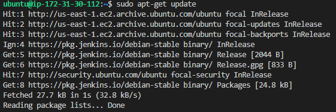

`sudo apt install default-jdk-headless`--(Running command to install java development kit as Jenkins is a java-based application)
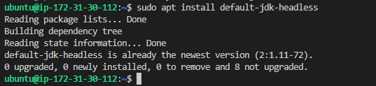

`curl -fsSL https://pkg.jenkins.io/debian-stable/jenkins.io-2023.key | sudo tee /
  /usr/share/keyrings/jenkins-keyring.asc > /dev/null
echo deb [signed-by=/usr/share/keyrings/jenkins-keyring.asc] /
  https://pkg.jenkins.io/debian-stable binary/ | sudo tee /
  /etc/apt/sources.list.d/jenkins.list > /dev/null`
`sudo apt-get update`;`sudo apt-get install jenkins -y`--(Running command to install Jenkins)
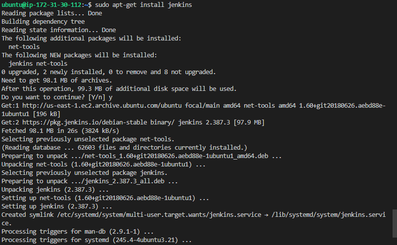

`sudo systemctl restart jenkins` ;`sudo systemctl status jenkins`--(Running command to install java development kit as Jenkins is a java-based application)
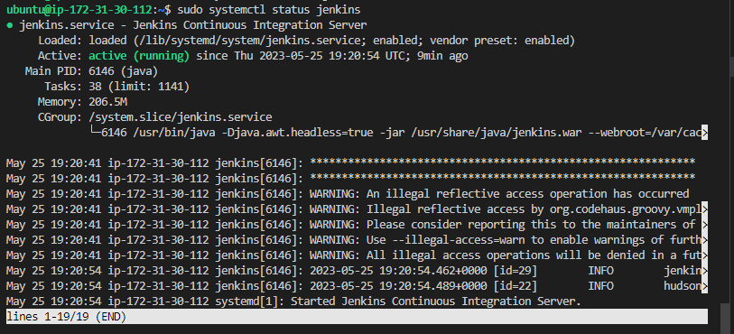

`<Jenkins-Server-Public-IP-Address-or-Public-DNS-Name>:8080` = `http://54.234.190.156:8080`--(By default Jenkins server uses TCP port 8080 – open it by creating a new Inbound Rule in your EC2 Security Group. Perform initial Jenkins setup. Using Jenkins Server Public IP Address ending with colon 8080 on web browser launches Jenkins home page requesting for password - secure security measure to unlock Jenkins)
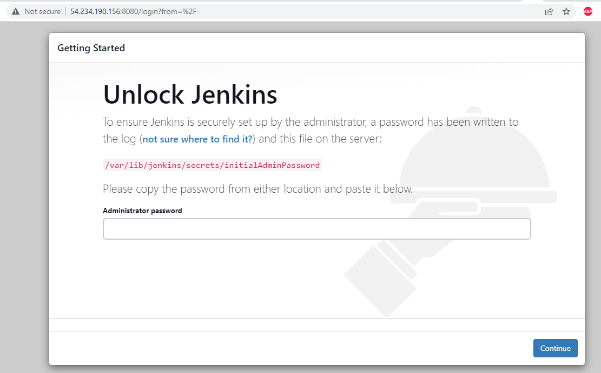

## Step 2 – Configure Jenkins to retrieve source codes from GitHub using Webhooks
--(To configure a simple Jenkins job/project which is triggered by GitHub webhooks and will execute a ‘build’ task to retrieve codes from GitHub and store it locally on Jenkins server.)
(1.Enable webhooks in your GitHub repository settings)
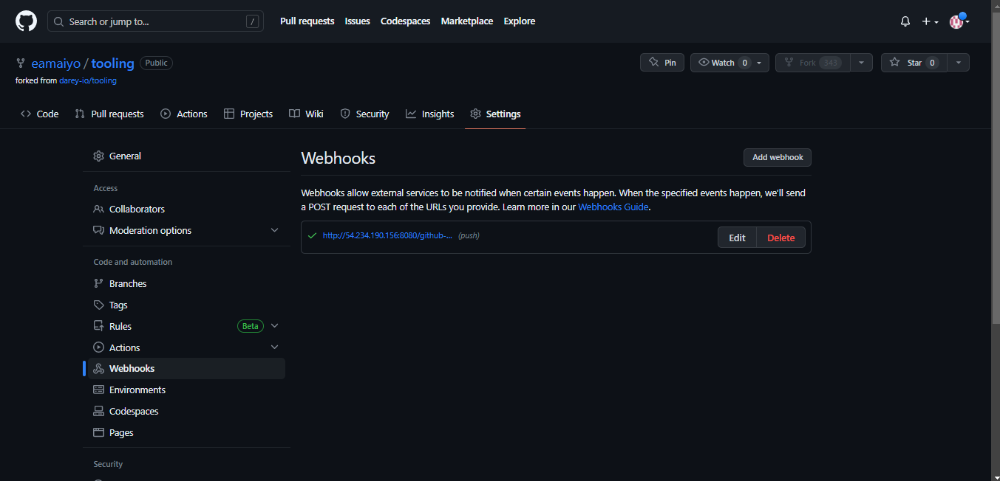

(2.In configuration of my Jenkins freestyle project we chose Git repository, which provide link to my Tooling GitHub repository and credentials (user/password) so Jenkins could access files in the repository)
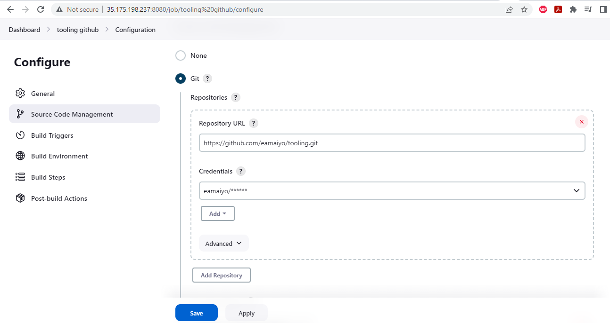

(3.A new build task was executed on job #4 which was ran manually at this stage. Build console output - build ran and finished successful)
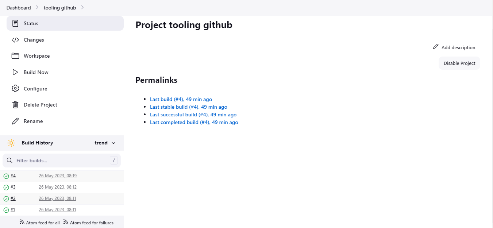
(./Image-9/Jenkins-Job-ConsoleOutput-9.PNG)

(3.Configure my job/project and add these two configurations, Configure triggering the job from GitHub webhook)
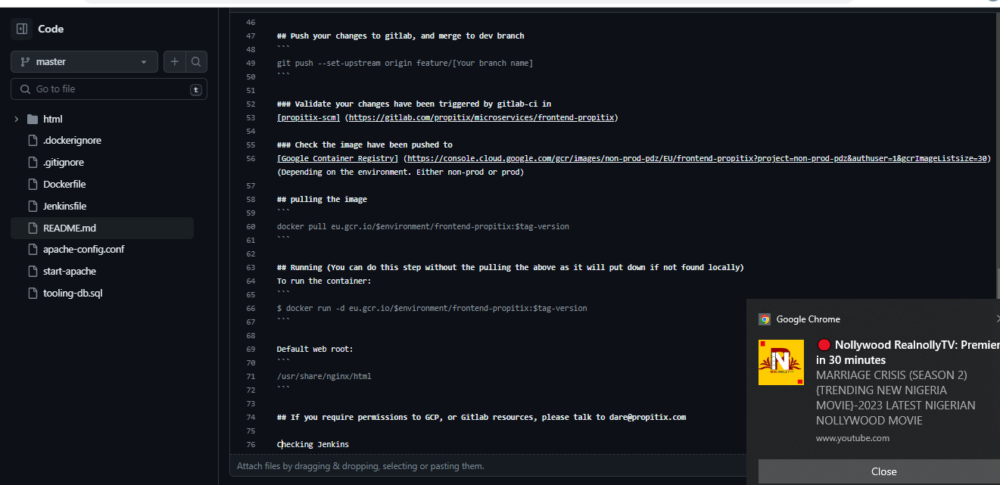

(4.Changes were made in (README.MD file) in my GitHub repository -(Insert - Checking Jenkins) -  and push the changes to the master branch. I observed a new build has been launched automatically (by webhook) and its results – artifacts, saved on Jenkins server.)

`cat /var/lib/jenkins/jobs/Evezi/builds/3/archive/READ.md`--(Using command to view artifact in the Jenkins terminal which is the new build pushed/launch by githuh webhook to Jenkins server.)
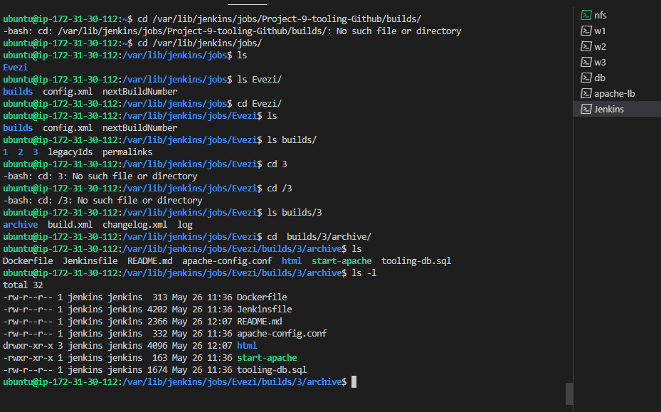
(./Image-9/Jenkins-NewBuild-Webhook-BuildArtifact-11a.PNG)

`cat /var/lib/jenkins/jobs/Evezi/builds/3/archive/READ.md`--(Using command to view artifact in the Jenkins terminal which is the new build pushed/launch by githuh webhook to Jenkins server.)

## Step 3 – CONFIGURE JENKINS TO COPY FILES TO NFS SERVER VIA SSH
Our artifacts is now stored locally in my Jenkins server. I will copy my artifact to my NFS server through mount point /mnt/apps directory.

--(Installing publisg over ssh software which is a plugin item available in manager jenkins repository/ store.)
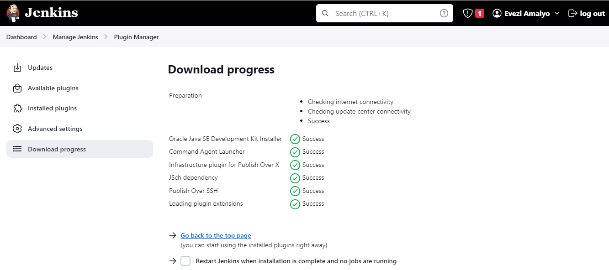

`sudo chown -R nobody:nobody /mnt/apps`; `sudo chmod -R 777 /mnt/apps`--(Using command to change ownership and set permission to the artifact that is copied over from jenkins server which is new build executed and launched from github webhood.)
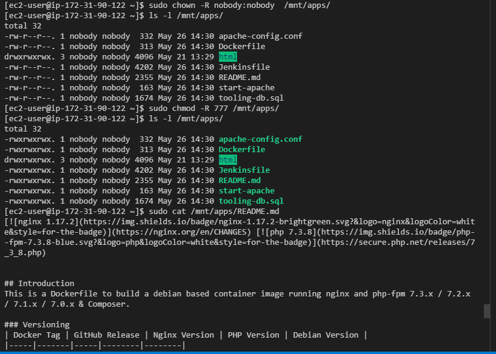

`sudo /mnt/apps/README.md`--(Confirm that I can view NFS server changes made in the Readme.md file inside Github tooling website, this is possible using the publish over ssh plugin.)
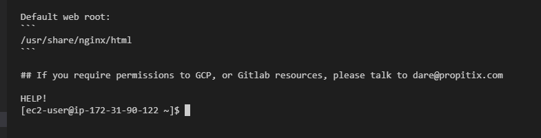